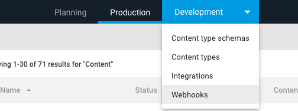
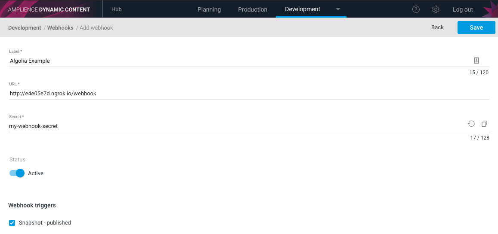

[](https://amplience.com/dynamic-content)

# dc-integrations-algolia

> A sample [Amplience Dynamic Content]((https://amplience.com/dynamic-content)) integration for [Algolia Search API](https://www.algolia.com/products/search/)


 


This project is a sample webhook integration that demonstrates how you can keep your Algolia Search index up-to-date with published content from Dynamic Content.

The rationale behind the structure of this project is to make components reusable and testable. To achieve this we have implemented a bespoke presenter/coordinator pattern that outlines all the possible error and success responses from each route handler. This makes it easier to trace the response that was surfaced and separates the responses to the client from the business logic.   

An example of our implemented presenter can be found [here](src/webhooks/snapshot-published-webhook-route-handler.ts).

[](https://heroku.com/deploy)

## _Warning_ 

* These following steps are just demonstrating how you can run this application for DEVELOPMENT purposes only.

* This application DOES NOT come with a warranty/support. We are not responsible for the outcome of this integration.

* DO NOT run this application in a production environment - this integration is a sample/example integration.

## Main Features

* Adds the top-level Dynamic Content Content-Item (keyed on the Content Item id) to your Algolia Search index when you publish a content graph
* Validates the Dynamic Content Webhook using a predefined secret
* Appends several unix formatted date fields to your Algolia record that you may useful when [sorting your index by date](https://www.algolia.com/doc/guides/managing-results/refine-results/sorting/how-to/sort-an-index-by-date/):
  * "_lastModifiedDate" - Algolia Record last modified date
  * "_snapshotCreatedDate" - Snapshot created Date
  * "_contentItemCreatedDate" - ContentItem created date
  * "_contentItemLastModifiedDate" - ContentItem last modified date

## Installation

Checkout this repo and install the dependencies via npm:

``` sh
npm install 
```

## Running the tests
The below command will run unit tests for the project and cover:
* Route handling
* Credential validation
* Environment variable validation
* SDK Error handling
* Webhook processing

```bash
npm run test
```

## Running in Development mode 

### 1. Configure your environment

Configuration values required to run the application should be saved in a `.env` file within the root of the project. Example is shown below:

```bash
DC_CLIENT_ID=my-dc-client-id
DC_CLIENT_SECRET=my-dc-secret
WEBHOOK_SECRET=dc-webhook-secret
ALGOLIA_APPLICATION_ID=my-app-id
ALGOLIA_API_KEY=my-api-key
ALGOLIA_INDEX_NAME=my-index-name
CONTENT_TYPE_WHITELIST=schema-id1;schema-id2;schema-id3
CONTENT_TYPE_PROPERTY_WHITELIST=prop1;prop2;prop3
```

#### 1.1 Using a different Dynamic Content environment
You can override the Dynamic Content API and Amplience Auth URLs by defining these optional environment variables:
```bash
DC_API_URL=https://...
DC_AUTH_URL=https://...
```

### 2. Start the application
To run this application locally, run the following (default port is 3000)

```bash
npm run start
```

If you require this app to run on a different port, set the PORT environment variable

```bash
PORT=1337 npm run start 
``` 

### 3. Exposing your local port externally

For development purposes you can use the awesome [ngrok](https://ngrok.com/), which will give you a public URL for your webhook integration. **This is only to be used for demonstration/development purposes**

1. [Install & configure ngrok](https://ngrok.com/download)

2. Expose your chosen http port
    ```bash
    ngrok http 3000
    ```

### 4. Create a webhook subscription

1. Go to the Webhook management section within Dynamic Content ("Development" -> "Webhooks" from the menu) 
  
    
    
    _If this option is not available to you, please open an support ticket requesting Webhook access - [Amplience Support](https://support.amplience.com/)_
2. Click the "Add webhook" in the top right.

    

3. Enter & save your webhook.
    * For this integration the URL must end in "/webhook"
    * Your secret must match the one you defined in step 1.
    * You must select the "Snapshot - published" with Webhook trigger 

    


### 5. Publish a content item

Publishing a content item should now trigger your Algolia integration to be invoked. You should see something similar in your console:

```bash
  express:router dispatching POST /webhook +999ms
  express:router query  : /webhook +1ms
  express:router expressInit  : /webhook +1ms
  express:router router  : /webhook +1ms
  express:router dispatching POST /webhook +0ms
```

## Response Codes
The application will respond with the following HTTP status codes based on the outcome of processing the webhook:

|  HTTP Status 	|   Outcome	|   Retryable	|
|-----|------|-------|
|  200 	|  Successfully processed 	|   N/A	|
|  202 	|  Accepted but not processed 	|   False	|
|  500 	|  An error occurred 	|   True	|

## Built with
* [Express](https://www.npmjs.com/package/express) - API framework
* [Amplience Dynamic Content SDK](https://www.npmjs.com/package/dc-management-sdk-js) - Used for fetching content from the Amplience Dynamic Content service.
* [Algolia Search API Client](https://www.npmjs.com/package/algoliasearch) - Used to add content to an Algolia search index.

## Contributing

If you would like to contribute to this project, please follow our [contributing guide](./CONTRIBUTING.md).

## License

This software is licensed under the [Apache License, Version 2.0](http://www.apache.org/licenses/LICENSE-2.0),

Copyright 2019 Amplience

Licensed under the Apache License, Version 2.0 (the "License");
you may not use this file except in compliance with the License.
You may obtain a copy of the License at

    http://www.apache.org/licenses/LICENSE-2.0

Unless required by applicable law or agreed to in writing, software
distributed under the License is distributed on an "AS IS" BASIS,
WITHOUT WARRANTIES OR CONDITIONS OF ANY KIND, either express or implied.
See the License for the specific language governing permissions and
limitations under the License.
